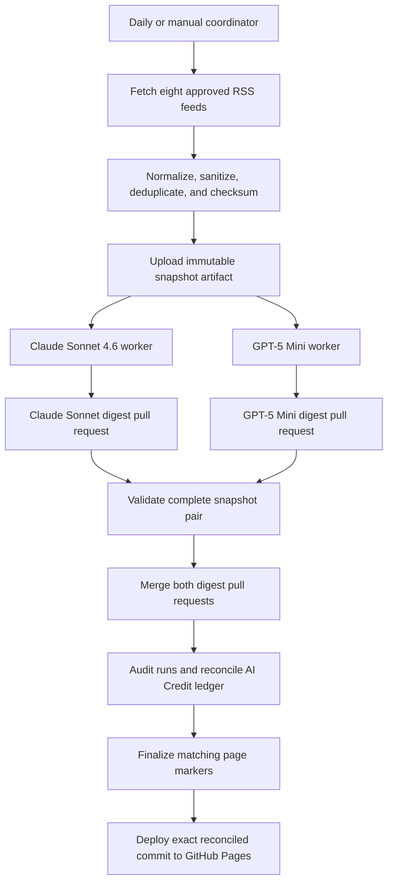

# Paired Model Experiment: Architecture and Operations

This project publishes two versions of the same daily AI news digest:

| Variant | Model | Published page |
| --- | --- | --- |
| Control | `claude-sonnet-4.6` | [Claude Sonnet 4.6 AI & Developer News Digest](https://elbruno.github.io/weekly-ai-news-digest/) |
| Economy | `gpt-5-mini` | [GPT-5 Mini AI & Developer News Digest](https://elbruno.github.io/weekly-ai-news-digest/economy/) |

The [Claude Sonnet 4.6 usage dashboard](https://elbruno.github.io/weekly-ai-news-digest/ai-credits.html) preserves the original baseline-model reporting. The [model comparison dashboard](https://elbruno.github.io/weekly-ai-news-digest/model-comparison.html) pairs both variants by snapshot and reports cost, savings, completion, and publication status. `control` and `economy` remain internal experiment identifiers; the published pages use descriptive digest titles and model attribution.

## Why run two models?

The experiment asks a practical question: can a smaller, less expensive model produce a useful digest from the same source material and editorial instructions while consuming fewer AI Credits?

A fair comparison requires more than running two workflows near the same time. RSS feeds can change between requests, duplicate stories can appear across feeds, and prompt differences can change the result. This project therefore holds the following inputs constant:

- one immutable RSS snapshot;
- one prompt contract and prompt version;
- one page template and validation contract;
- one publication and accounting process.

The intended independent variable is the model. The dashboards quantify cost and operational outcomes. They do not claim that cost alone measures editorial quality; the two published pages remain available for direct human comparison.

## End-to-end flow



### 1. Collect one deterministic snapshot

`.github/workflows/digest-experiment.yml` runs every day at 10:00 UTC or through manual dispatch. It invokes `scripts/collect-news-snapshot.py`, which:

1. downloads the eight approved RSS or Atom feeds;
2. rejects oversized feeds and malformed entries;
3. converts HTML excerpts to plain text;
4. normalizes URLs and removes common tracking parameters;
5. deduplicates entries by normalized URL and title;
6. keeps recent entries in a stable order;
7. computes a content-derived snapshot ID; and
8. uploads the JSON as a 90-day GitHub Actions artifact.

The two workers receive the coordinator run ID and expected snapshot ID. Each worker downloads the same artifact and validates its schema, checksum, and identifier before invoking its model.

### 2. Run the paired agentic workflows

The worker definitions are:

- `.github/workflows/daily-digest-control.md`
- `.github/workflows/daily-digest-economy.md`

Both import `.github/workflows/shared/digest-generation.md`, so they share the same curation rules, bilingual output requirements, page behavior, and validation checklist. Snapshot content is treated as untrusted data: workers cannot follow instructions from feed text, browse article URLs, replace facts from model memory, or fetch a different set of sources.

Each worker is compiled by `gh-aw` into a `.lock.yml` workflow. The coordinator records the exact dispatched run IDs, waits for both runs to succeed, and only then explicitly dispatches the publisher.

### 3. Create isolated safe-output pull requests

The agents have read-only repository access. Repository changes are created through `safe-outputs` after threat detection:

- control can modify only `docs/index.html`;
- economy can modify only `docs/economy/index.html`;
- both must create non-draft pull requests with their expected variant labels.

Each page embeds the variant, model, snapshot ID, prompt version, and workflow run ID. It initially shows `Pending finalization` for AI Credit usage because the authoritative audit is available only after the agent run completes.

### 4. Validate and publish a complete pair

`.github/workflows/auto-merge-digest.yml` serializes publication. Before merging, it verifies:

- GitHub Actions created the pull request;
- the pull request is not a draft;
- exactly one recognized variant label is present;
- exactly one allowed page changed;
- the title contains a valid snapshot ID; and
- both control and economy pull requests exist for that same snapshot.

A partial pair is left open rather than published. Duplicate or malformed candidates fail validation. A scheduled publisher run at 10:30 UTC remains as a recovery path in addition to explicit coordinator dispatch and manual dispatch.

### 5. Reconcile AI Credits and deploy

After merging a pair, the publisher audits completed worker runs with `gh aw audit` and updates `docs/data/ai-credits.json`. Each schema-v2 record includes:

- run ID and timestamps;
- workflow, variant, and pinned model;
- immutable snapshot ID and prompt version;
- originating coordinator event;
- conclusion and duration;
- AI Credit total when an audit is available;
- page path, publication state, and quality state; and
- a link to the GitHub Actions run.

Failed or incomplete runs remain visible even when cost data is unavailable. This avoids hiding reliability differences between models.

The page finalizer updates an AI Credit marker only when the current page belongs to that exact workflow run. Historical records remain in the ledger but cannot rewrite a newer digest. The publisher commits the reconciled ledger and page markers, then deploys that exact commit from `docs/` to GitHub Pages.

## Reliability and safety properties

- **Comparable inputs:** both models consume the same immutable snapshot.
- **Comparable instructions:** both workers import one versioned prompt contract.
- **No direct agent writes:** agents propose tightly scoped pull requests.
- **Atomic publication:** only complete control/economy pairs are merged.
- **Serialized publishing:** concurrent publisher runs cannot race each other.
- **Strict page ownership:** a run can finalize only its own embedded marker.
- **Auditable costs:** raw run-level records are committed to the repository.
- **Deterministic dashboards:** browser JavaScript calculates comparisons without another AI call.
- **Exact deployment:** Pages deploys the reconciliation commit, not a moving branch head.

## Failure and recovery behavior

| Failure | Result | Recovery |
| --- | --- | --- |
| RSS collection or snapshot validation fails | No workers are dispatched | Fix the source or parser, then rerun the coordinator |
| Either worker fails | Coordinator fails and does not dispatch publication | Inspect that worker run, then rerun the complete experiment |
| Only one digest pull request exists | Publisher leaves it open | Recover or rerun the missing variant |
| Pull request violates author, label, title, or file rules | Publisher fails validation | Correct the workflow; do not bypass the guard |
| AI Credit audit is temporarily unavailable | Run remains in the ledger with `aic: null` | Rerun the publisher to reconcile later |
| `main` changes during reconciliation | Publisher retries from the latest `main` | Automatic, up to three attempts |
| Explicit publisher dispatch is missed | Pair remains queued | The 10:30 UTC fallback or manual publisher run processes it |

## Operating the experiment

Start a complete paired run from the [Daily Digest Experiment workflow](https://github.com/elbruno/weekly-ai-news-digest/actions/workflows/digest-experiment.yml). Do not dispatch the two worker workflows independently for normal operation; the coordinator is responsible for the shared snapshot and paired lifecycle.

When changing the shared prompt or either worker's frontmatter, compile both definitions:

```bash
gh extension install github/gh-aw
gh aw compile --strict .github/workflows/daily-digest-control.md
gh aw compile --strict .github/workflows/daily-digest-economy.md
```

Run the deterministic checks before publishing workflow changes:

```bash
python scripts/collect-news-snapshot.test.py
node --test scripts/update-ai-credit-usage.test.mjs scripts/ai-credit-utils.test.cjs
```

Treat these files as one publication contract when changing behavior:

- `docs/template.html`
- `docs/index.html`
- `docs/economy/index.html`
- `docs/ai-credits.html`
- `docs/model-comparison.html`
- `docs/data/ai-credits.json`
- `scripts/update-ai-credit-usage.mjs`
- `.github/workflows/auto-merge-digest.yml`

## Interpreting results

Use the comparison dashboard to evaluate paired AI Credit savings and whether both variants completed and published. Use the two digest pages to compare selection, summaries, bilingual copy, and usefulness. A cheaper run is promising only when it also produces an acceptable reader experience and completes reliably.

Changing a model or prompt creates a new experimental condition. Record the change in the workflow definition and increment the prompt version when the shared editorial contract changes, so later comparisons are not mistaken for like-for-like results.
